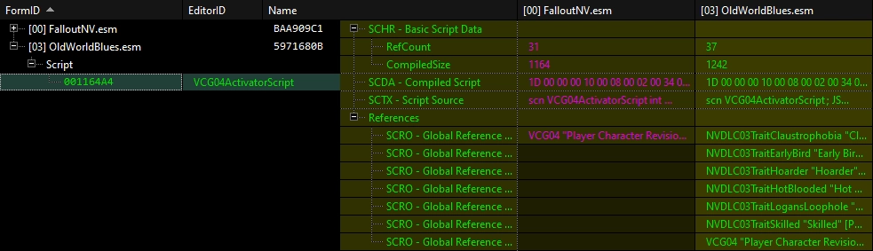
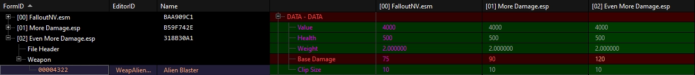
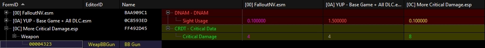
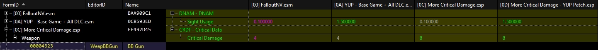
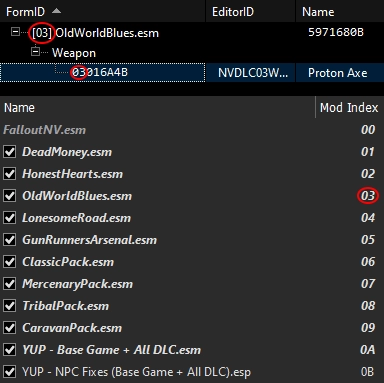
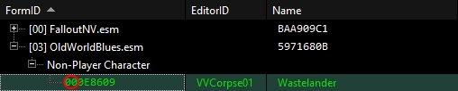
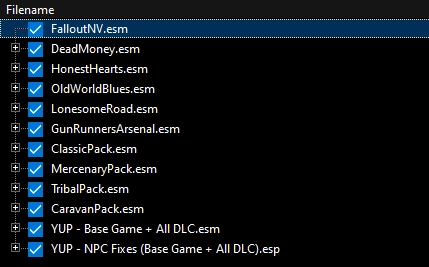
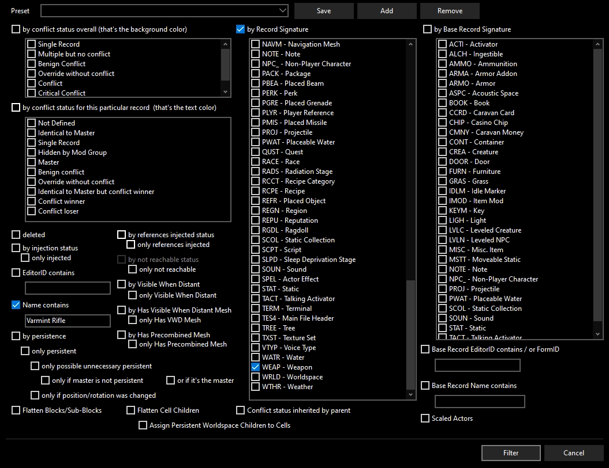
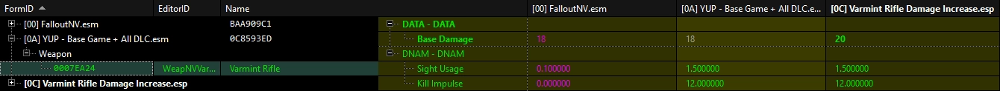
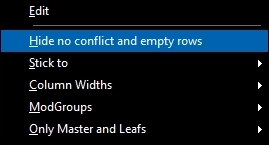

# Basics of xEdit

xEdit is a tool for Bethesda titles that you can use to edit plugins (.esp/.esm/.esl files) and have a visual representation of how the edits overlap with the base game or other mods. This allows you to compare changes and easily do things such as patching, understanding what a mod does, editing mods or the vanilla game, and more.

## Setup

1. **Download the latest xEdit release** from the [xEdit Discord server](https://discord.gg/5t8RnNQ), in the **xedit-builds** channel (ignore the "EXTREMELY_EXPERIMENTAL" versions).
2. **Extract the archive** and place the files inside a folder of your choosing (do not use a UAC protected folder or the game folder).
3. **Add xEdit to the list of programs in Mod Organizer 2** by pressing **CTRL + E** and then clicking `Add from file...`, then point it to the xEdit executable you extracted previously (not the x64 executable). (As with most modding tools, xEdit has to run through MO2 in order to see your mods.)

> Avoid using the x64 executable as it may lead to rounding errors. It becomes necessary only when dealing with an extremely large volume of data (which is highly unlikely on older titles such as FNV) or during very long sessions.

4. Based on the game you are modding, **pass the corresponding argument**. This is what tells xEdit what game it's meant to look for:

   - Oblivion: `-TES4`
   - Skyrim Legendary Edition: `-TES5`
   - Skyrim Special Edition (AE or not is irrelevant): `-SSE`
   - Fallout 3: `-FO3`
   - Fallout New Vegas: `-FNV`
   - Fallout 4: `-FO4`

5. Run the program (always from MO2, for the reason stated before).

## Terminology

- **Override**: Taking an existing record in a plugin and then editing it in another plugin.  
  FalloutNV.esm originally created this script, then OldWorldBlues.esm **edited it with an override**.
  

> You can **view the right-pane of xEdit as an Excel spreadsheet** with **as many columns as there are plugins editing that record**. The game will only care about the right-most column, which is the the script Old World Blues has.

- **Conflict**: This happens once you have multiple mods trying to edit a record. xEdit will represent these conflicts based on their type and with different colors both for the background of that record and for the text (there's a legend on the top right corner of xEdit).  
  The **More Damage mod** increases the Alien Blaster's damage **from 75 to 90**. But then the **Even More Damage mod** increases it **from 75 to 120**. **This causes a conflict** between the 2 damage mods, so the user would have to decide which to use prioritize by removing either mod or switching their load order.  
  

> IMPORTANT: The colors of a record do **NOT** indicate whether you need to act or not, it's simply a classification of the type of conflict. Green does not mean good and red does not mean bad.

- **Forwarding**: Taking a change from a plugin and copying it over to another plugin, most often used for patching conflicts.  
  **YUP is fixing the Sight Usage** value of the BB Gun, **but the More Critical Damage mod is trying to increase Critical Damage**. The problem here is that the More Critical Damage mod was not made with YUP in mind, so it did not include that Sight Usage fix. For this reason, **we need to create a patch** to forward the Sight Usage so that it is edited at the same time as the Critical Damage.  
    
  Once the patch is created (instructions for this later), we went from a conflict that needed intervention to **both changes taking effect**.  
  

> For the best modularity in your load order and to be able to keep track of all of your changes after the installation of a mod, **it is a good idea to create patches as new plugins** (just like the YUP Patch in the picture above), instead of editing the main plugin. This also allows you to skip some work when the mod gets updated, since your patch would remain.

## Plugin Structure

You can think of plugins as **a list of objects in unique containers** divided based on what type of content is in them (for example one of the "containers" is called **WEAP**, inside which you fill find the game's weapons). **Each of these objects is a record**. A record contains a bunch of information inside it about its functionality and characteristics.

> The following examples will use a Fallout New Vegas load order, but these concepts are not specific to New Vegas.

### The FormID

Each of these objects has its own **unique ID called FormID**, written in HEX. A FormID is split in 2 parts, the **index** and the **ID** itself. The index (indicated by the first 2 digits for non-ESL plugins, the first 5 for ESL plugins) is an indicator of where the plugin that created that record is located in your load order.

In this picture, the record I expanded has the FormID `0316A4B`, that means that **OldWorldBlues.esm created this record** and it is placed at **index 3**, the the record's ID is **16A4B**.  

If I then randomly select another record in the same plugin, there's a different index. This is because **this record was not created by Old World Blues**, but the DLC is actually editing a record that was first created by **FalloutNV.esm**, which sits at index 00 since it is the game's base plugin. **This is an override** and it is indicated by there being a color (a unique record with no other plugin involved would be blank, like in the first picture).  

## A Practical Example

Let's say I want to edit something in my game, such as the **damage of the Varmint Rifle**. Let's also assume that **I don't know the FormID** of that weapon:

1. Load all of your plugins (to not miss any mod edit to the same weapon).  
   
2. Once everything has loaded the tips will go away and start looking for that gun by right-clicking any plugin on the **tree-view** (that's the list on the left) and selecting `Apply Filter`. This will open a menu with all sorts of criteria to filter by. First of all, uncheck all the boxes it has selected by default, then **set up a custom filter** that will find the weapon.  
   
3. **Apply the filter** by clicking `Filter` in the bottom-right corner.
4. In this case, the filter found multiple weapons. **Expand the last plugin** (so that this new override copies the latest instance of that weapon, since YUP edits it and those change should be preserved).
5. Right-click the Varmint Rifle, then select `Copy as override into...`. This will let you **create a new plugin** with a name of your choice where the damage change will happen.
6. To make a new plugin, select `<new file>.esp` in the prompt, then name it. Once created, it will appear at the bottom of the **tree-view** and **a new override will appear on the right-pane**.
7. **Filter for "damage"** on the top left of the right-pane and edit the value to satisfaction.  
   
8. Once the mod is created, **close xEdit** and **enable the plugin** in MO2.
9. (**Optionally**) **move it out of the overwrite folder** into a new mod by right-clicking the overwrite or double-clicking it and dragging the plugin into a newly created empty mod.

## Some Tips

1. The [xEdit Discord server](https://discord.gg/5t8RnNQ) also serves as a **great place to search for information**, such as what specific record fields do. You can do so by using the filter on the top right of the Discord app or by pressing CTRL+F.
2. When looking at records on the right-pane, you can **exclude any unedited field** by right-clicking anywhere and enabling `Hide no conflict and empty rows`. This is especially helpful when looking for conflicts and when patching, since it hides all the fields that aren't of interest, grouping up all the ones that you need.  
   
3. Once you have enough confidence with the tool and want to **get rid of the annoying timed warning** when trying to make an edit, add `-IKnowWhatImDoing` to the arguments field of xEdit in MO2.
4. If you think you made an **error after saving multiple times**, do not be alarmed. xEdit will not actually save into the original plugin until the tool is closed. Temporary saves will be sent to overwrite folder of MO2 and they will have a timestamp appended to their extension. Simply backup the exact version you want to roll back to, and close xEdit.
5. **Scan for errors in a session with only that specific mod + its masters loaded**. This prevents false positives caused by additional mods editing linked records later in the load order.
